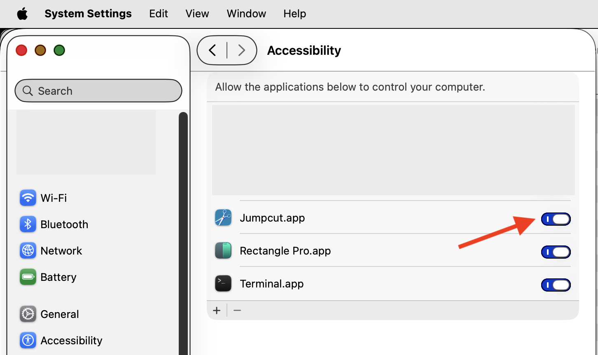

# Jumpcut - Justin's fork

- Strip away 3rd-party libs to reduce supply-chain attacks
	- no auto-updating (Sparkle) ((TODO: link to Sparkle src code))
	- no fancy multi-tab Preferences pane ((TODO: same))
	- no support for non-qwerty keyboard layouts (Sauce) ((TODO: same))
	- no launch at login (LaunchAtLogin) ((TODO: same))


- TODO
	- add test coverage
	- finish removing 3rd party libs
	- convert to normal app (with app icon that shows up in cmd-tab app cycling, and whose app name appears in top menu bar when app is selected)


About
=====

Jumpcut is a clipboard manager for macOS, providing access to text that
you've cut or copied, even if you've subsequently cut or copied something
else.

Jumpcut has a lightweight, intuitive interface and is 100% focused on
your clipboard, keeping code snippets, email addresses, URLs, and that
sentence that you actually had _just right_ five minutes ago close to hand.

This fork targets the current macOS only (macOS 26 Tahoe), built with
Xcode 26, and is in the middle of removing its third-party dependencies.

Building and running
====================

Build a signed debug build, stamping in the git commit SHA so the running
app can be identified (see "Verifying the running build" below):

```sh
xcodebuild -project Jumpcut/Jumpcut.xcodeproj -scheme Jumpcut -configuration Debug \
  -allowProvisioningUpdates JUMPCUT_GIT_SHA="$(git rev-parse --short HEAD)" build
```

Run the resulting `Jumpcut.app` (it lives under the build's
`Build/Products/Debug/` directory). Jumpcut is a menu-bar app with no Dock
icon; look for its icon near the right of the menu bar.

Verifying the running build
---------------------------

So you can confirm exactly which commit a running copy was built from, the
short git SHA is stamped into `Info.plist` at build time
(`JumpcutGitSHA = $(JUMPCUT_GIT_SHA)`) and shown in the About panel. Open the
menu-bar icon → **About Jumpcut**; the version line reads
`Version 0.84 (git <sha>)`, which should match `git rev-parse --short HEAD`.
A plain Xcode GUI build that does not pass `JUMPCUT_GIT_SHA` shows `git dev`.

Accessibility permission
========================

Jumpcut pastes a chosen clipping into the frontmost application by
synthesizing a ⌘V keystroke. macOS only permits that if Jumpcut has been
granted **Accessibility** permission. Without it, selecting a clipping still
copies it to the clipboard (you can paste it yourself with ⌘V), but Jumpcut
cannot paste for you.

To grant it, open **System Settings → Privacy & Security → Accessibility**,
click **+**, add `Jumpcut.app`, and turn its toggle on:



A debug build does not prompt for this automatically, so add it by hand. The
permission is tied to the app's code signature, so once granted it persists
across rebuilds as long as the signing identity is unchanged. If a rebuild
ever stops pasting, toggle the permission off and on (or remove and re-add
the app) to refresh it.
